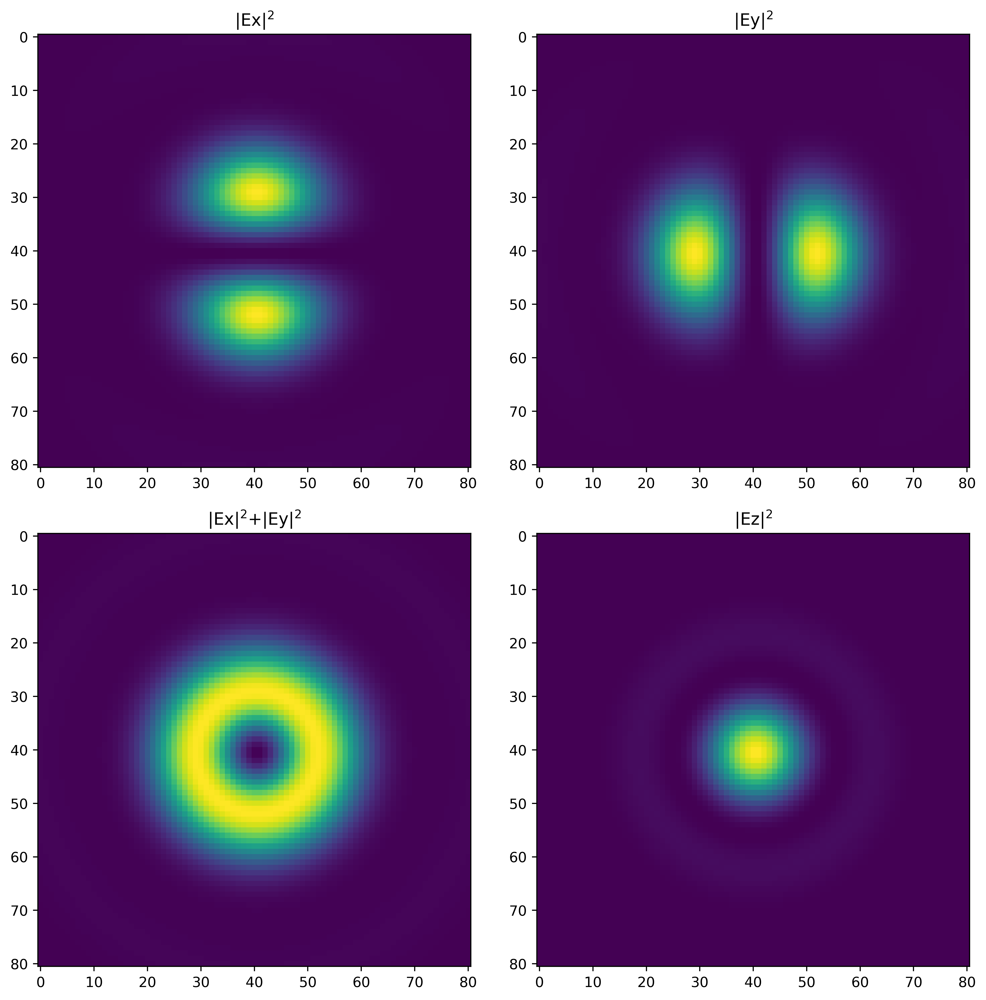
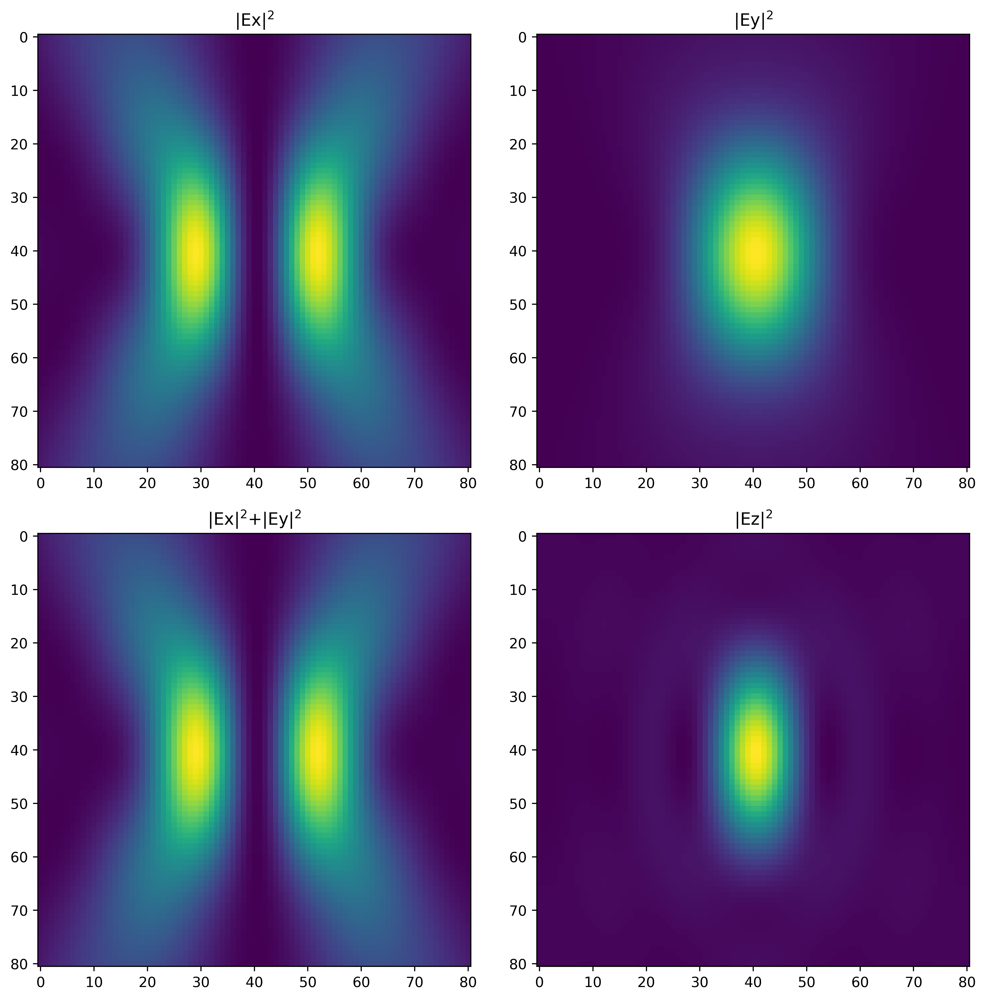

# Radialer: Calculation of Spatial Distribution of Radial Polarization

2024/7/5


Radialer is a C++ project designed to generate a 3D radialial polarization and export them into txt, npy files. In literature, "**cylindrical vector beams**"[1,2] are used to describe the mode. I used to use python [MEEP](https://meep.readthedocs.io/en/latest/) for running a lot of electromagnetic simulations. However, there is no c++ implementation for radial polarization in MEEP. Python scripts are not ideal for large-scale computation. This project provides python MEEP users an easy and efficient tool to create a 3D waveform of radial polarization instead of using python implementation. Jupyter notebooks are provided for data visualization and simple simulation demonstration. Since the focal field distribution is exported as independent files, porting to other FDTD simulation solvers might be possible. 

## Table of Contents
- [Features](#features)
- [Installation](#installation) 
	- [Prerequisites](#prerequisites)
  - [Building the Project](#building-the-project)
- [Usage](#usage) 
- [Examples](#examples) 
- [Reference](#reference)
- [Disclaimer](#disclaimer)
- [Contribution](#contribution)
- [License](#license)
- [Keywords](#Keywords)

## Features

- High-performance computing with C++
- Build system integration using CMake
- Uses Boost libraries for efficient numerical calculations
- Data visualization with matplotlib (Jupyter notebook)

## Installation
### Prerequisites
- CMake (version 3.10 or higher)
- Boost library 
- cnpy (optional) 
- HDF5 library (optional) 

### Building the Project
1. Clone the repository:
   ```sh
   git clone https://github.com/mithgil/Radialer.git
   cd Radialer

2. Create a build directory and navigate to it:
	```sh
	mkdir build
	cd build
	```
3. Run CMake to configure the project:
	```sh
	cmake ..
	```

4. Buid the project
	```sh
	make
	```

## Usage

To run the project, use the following command:
```sh
./build/runradial
```

The whole project is built and tested using Unbuntu 20 LTS. Any of Linux distro may not encounter problems. Users can choose the precompiled version. The aurthor of the project presumes the MEEP users work in a Linux environment. The installation for MEEP can be found [here](https://meep.readthedocs.io/en/latest/Installation/). 

and then a 4D array of the field will be output as txt and npy. (h5 file is buggy). The file can be visualized by python (`/tests/vis.ipynb` and `read.py`). 

The Numpy npy file format is binary and more lightweight than txt file format. 

The txt-format array can be imported through the functions in `read.py`.

## Examples

### Functions

Mathematical form of the electromagnetic wave of radial polarization is in complex form here. The full calculation including imaginary part is not necessary. It is just for retaining the physical notation and MEEP data-type input in the calculation. Minor modifications could be done here. Waveform input for a MEEP simulation will be in complex form here. 

Gaussian-quadrature (from `Boost`) is applied in the numerical integrations. This method is more accurate and efficient than other numerical integration methods. Numerical integral function using mid-point method is tested before but not used anymore. Numerical integrals using Gaussian-quadrature rule take around 2 minutes, and is about 3.5 faster than that by midpoint rule on my Linux laptop with a 8th-gen i5 CPU. 

### Main usage:

Example code snippet in `/tests/main.cpp`

```c++
	int dimSet = 81; // pixels per dimension
    float wavelengthSet = 0.636; // um
	float fillfactorSet = 1.0; //filling factor
    float ampSet = 1.0; // amplitude
    float NASet = 0.998; // numerical aperture
    float hwindowSet = 1.0; // half window in um
```
where
- `dimSet` will determine the pixels for each dimension of the array as `(3,dimSet,dimSet,dimSet)`, where the first `3` denotes (x,y,z). MEEP can interpolate grids if the waveform array and simulation cell are mismatched. 
- `fillfactorSet` denotes the filling factor, which is determined by the experimental condition. For overfilling backaperture of an objective, it can be set to `1.0`. 
- **Apodization function**: here Gauss-Bessel function is utilized. Please go to `/src/radial.cpp` for modifications of code and do `make` again if other functions are chosen. 
- `ampSet` here is the amplitude and set as `1.0`. So the later simulation in MEEP will have the overall waveform without defining an absoluted physical value. The relative amplitudes can still be compared within the same simulation. If one has concern about this value, please replace it with a value closer to the experimental one. 
- `NASet` would depend on the objective or parabolic mirror to focus the beam. Here, the `NASet` is `0.998` since an on-axis parabolic mirror in air is applied.
- `hwindowSet` is half of window in each dimension of the calculation. The whole window will be `2*hwindowSet` in each dimension.
- **units** for each dimension here are $\mu m$ since the units definitions in [MEEP](https://meep.readthedocs.io/en/latest/Introduction/) universe.

These parameters for calculations can let user clearly visualze the focal field in the [jupyter notebook](https://docs.jupyter.org/en/latest/) (`/tests/vis.ipynb`) and implement the field as [source](https://meep.readthedocs.io/en/latest/Python_User_Interface/#source) in MEEP .

For xy cross-section, 



For xz cross-section,



Radial polarization implemented in MEEP

<video width="400" height="300" controls>
  <source src="./tests/radial_Ez.mp4" type="video/mp4">
</video>

One can find the examples in the `/tests` directory.

## Reference

1. Qiwen Zhan, "Cylindrical vector beams: from mathematical concepts to applications," Adv. Opt. Photon.(2009) 

2. Youngworth, Kathleen S., and Thomas G. Brown. "Focusing of high numerical aperture cylindrical-vector beams." Optics Express 7.2 (2000)


## Disclaimer
This project is considered as experimental. If anyone creates and publishes incorrect or misleading simulation results using this C++ project along with MEEP, I, as the maintainer of the project, am not responsible for that. 

## Contribution

Contributions are welcome! Please fork the repository and submit a pull request. 


## License

Distributed under the GNU general public License. See LICENSE for more information.

## Keywords
- Radial Polarization
- MEEP
- FDTD Simulation
- Computational Electromagnetics

